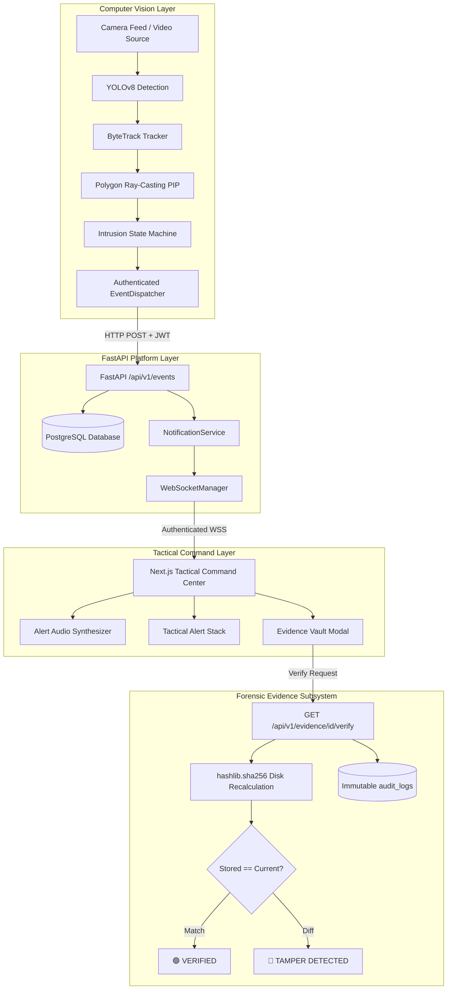

# IBVAP — Final System & Security Architecture Reference

This document provides the authoritative end-to-end architecture and security control mapping for the IBVAP platform.

---

## 1. End-to-End System Pipeline

---

## 2. Security Control Association Matrix

| Layer | Security Threat | Mitigating Control | Implementation File | Verification Status |
|---|---|---|---|---|
| **Frontend** | Unauthorized URL Access | Client-side route guards + AuthContext redirect | [`AppShell.tsx`](file:///Users/hardik/Downloads/IBVAP/frontend/components/layout/AppShell.tsx) | **PASS** |
| **Transport** | Session Hijacking / Forgery | 15-Minute Scoped JWT Bearer Tokens | [`auth_service.py`](file:///Users/hardik/Downloads/IBVAP/backend/app/services/auth_service.py) | **PASS** |
| **API** | Privilege Escalation | Role-Based Access Control (`require_role`) | [`deps.py`](file:///Users/hardik/Downloads/IBVAP/backend/app/api/deps.py) | **PASS** |
| **Database** | Brute Force Credential Guessing | Argon2id Key Derivation + Sliding Rate Limiting | [`auth_service.py`](file:///Users/hardik/Downloads/IBVAP/backend/app/services/auth_service.py) | **PASS** |
| **AI** | Rogue Model Injection | SHA-256 Checksum Validation (Fail-Closed) | [`model_validator.py`](file:///Users/hardik/Downloads/IBVAP/ai/detection/model_validator.py) | **PASS** |
| **Events** | Duplicate / Replay Incursions | Deterministic `event_identifier` Idempotency | [`event_service.py`](file:///Users/hardik/Downloads/IBVAP/backend/app/services/event_service.py) | **PASS** |
| **WebSocket** | Eavesdropping / Injection | Query Handshake JWT Authentication (Code 1008) | [`ws.py`](file:///Users/hardik/Downloads/IBVAP/backend/app/api/routes/ws.py) | **PASS** |
| **Evidence** | Unauthorized File Tampering | Server-Authoritative Binary SHA-256 Digest | [`evidence_integrity_service.py`](file:///Users/hardik/Downloads/IBVAP/backend/app/services/evidence_integrity_service.py) | **PASS** |
| **Audit** | Repudiation of Operator Action | Append-only PostgreSQL `audit_logs` ledger | [`audit_service.py`](file:///Users/hardik/Downloads/IBVAP/backend/app/services/audit_service.py) | **PASS** |
