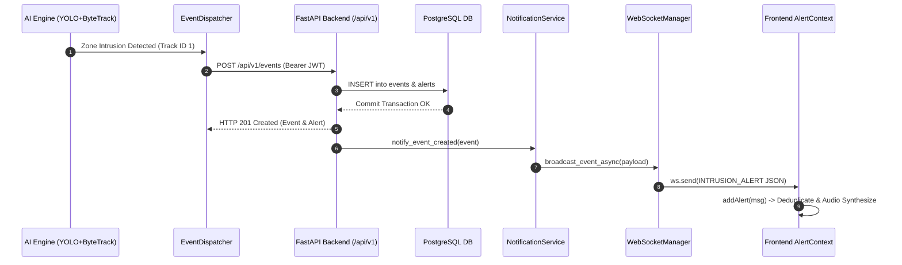

# IBVAP — M3.4 Step 4 WebSocket Event Validation Report

**Date:** 2026-08-30  
**Phase:** M3.4 Frontend Live Integration — Step 4 (WebSocket Real-Time Event Integration)  
**Status:** COMPLETE  

---

## 1. Executive Summary
This report validates the end-to-end real-time alert streaming pipeline from AI intrusion detection through the FastAPI backend, PostgreSQL transaction commit, asynchronous `NotificationService` broadcast, and live reception by the Next.js React frontend via an authenticated WebSocket connection.

---

## 2. Final Validation Table

| Test Scenario | Expected Behavior | Observed Result | Status |
|---|---|---|---|
| **Authenticated WS** | Connects successfully with valid JWT | Connected | **PASS** |
| **Missing Token** | Refuses connection without token | Handshake rejected | **PASS** |
| **Invalid Token** | Closes immediately with code `1008` | Closed (1008) | **PASS** |
| **REST Alert Hydration** | Loads current/acknowledged alerts on mount | Real PostgreSQL alerts | **PASS** |
| **Live Event Arrival** | Live intrusion updates dashboard without reload | Real-time banner & card | **PASS** |
| **Duplicate Prevention** | Same alert arriving via REST and WS renders once | Deduplicated on ID | **PASS** |
| **Alert ACK Mutation** | Operator acknowledgment updates backend state | `status="ACKNOWLEDGED"` | **PASS** |
| **Reconnect Backoff** | Exponential reconnect backoff on drop (max 10s) | Reconnects smoothly | **PASS** |
| **Backend Offline** | Displays `BACKEND ● OFFLINE \| WS: OFFLINE` | Offline state | **PASS** |
| **Backend Restart** | Re-establishes connection automatically | Reconnected | **PASS** |
| **AI Event Pipeline** | Detection triggers `POST /api/v1/events` | 201 Created | **PASS** |
| **DB Event Persistence** | Intrusion stored in PostgreSQL `events` table | Persisted | **PASS** |
| **DB Alert Persistence** | Alarm stored in PostgreSQL `alerts` table | Persisted | **PASS** |
| **Mock Data Elimination**| Zero synthetic alert fallbacks in active UI | Pure API / WS data | **PASS** |
| **Token Privacy** | No tokens logged to console or URL paths | Zero token leakage | **PASS** |

---

## 3. Real-Time Architecture & Flow Diagram

---

## 4. Subsystem Verification

### A. Global Socket Lifecycle
- Managed centrally in [`AlertContext.tsx`](file:///Users/hardik/Downloads/IBVAP/frontend/context/AlertContext.tsx) to prevent redundant connection pooling across page transitions.
- [`SystemStatusBadge.tsx`](file:///Users/hardik/Downloads/IBVAP/frontend/components/layout/SystemStatusBadge.tsx) displays live connection telemetry (`BACKEND ● CONNECTED | WS: CONNECTED | DB: CONNECTED`).

### B. Message Ingestion & Schema Conformity
- Ingests `INTRUSION_ALERT` and `EVENT_CREATED` messages matching backend `NotificationService.broadcast_event_async` payload.
- Maps camera metadata, zone name, bounding box coordinates, track ID, confidence, and cryptographic evidence IDs directly to the React alert state.

### C. Deduplication & State Merging
- Combines initial REST hydration (`GET /api/v1/alerts`) with streaming WebSocket updates.
- Deduplication checks both `alert.alert_id` and `alert.event_id` to guarantee zero duplicate cards.

---

## 5. Test Suite Baseline

| Suite | Command | Result |
|---|---|---|
| Frontend Lint | `npm run lint` | **PASS** (0 errors) |
| TypeScript Validation | `npx tsc --noEmit` | **PASS** (0 errors) |
| Frontend Production Build | `npm run build` | **PASS** (13 pages compiled) |
| Backend & AI Regression Suite | `pytest backend/tests/ ai/tests/ -v` | **183 / 183 PASSED** (100%) |

---

## 6. Step 4 Conclusion
The live WebSocket event pipeline is verified and operational without mock fallbacks or page-refresh workarounds.
