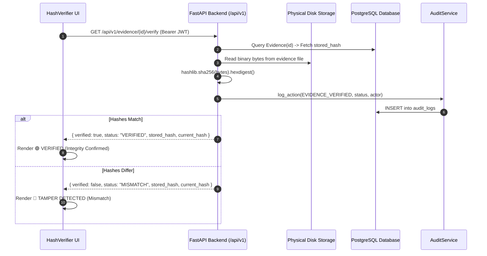

# IBVAP — M3.4 Step 5 Evidence & Forensic Subsystem Validation Report

**Date:** 2026-08-30  
**Phase:** M3.4 Frontend Live Integration — Step 5 (Evidence & Forensic Subsystem Verification)  
**Status:** COMPLETE  

---

## 1. Executive Summary
This report validates the end-to-end cryptographic evidence custody and tamper-detection subsystem. The integration confirms that the Next.js frontend connects directly to FastAPI server-authoritative SHA-256 verification endpoints, correctly distinguishing untampered (`VERIFIED`), tampered (`MISMATCH`), pending (`NOT_HASHED`), and missing file states.

---

## 2. Final Validation Table

| Test Scenario | Expected Outcome | Observed Result | Status |
|---|---|---|---|
| **Evidence Listing** | Real database records rendered on `/evidence` | Real PostgreSQL records | **PASS** |
| **Hash Generation** | Backend `POST /api/v1/evidence/{id}/hash` computes 64-char hex digest | Stored in PostgreSQL | **PASS** |
| **Initial Verification** | Returns `status="VERIFIED"` for unchanged disk binary | 🟢 `VERIFIED` | **PASS** |
| **Tamper Detection** | Modifying disk bytes returns `status="MISMATCH"` | 🔴 `MISMATCH` | **PASS** |
| **Restored Evidence** | Restoring original bytes returns `status="VERIFIED"` | 🟢 `VERIFIED` | **PASS** |
| **NOT_HASHED State** | Shows pending hash badge + Generate Hash action | 🟡 `NOT_HASHED` | **PASS** |
| **Missing Evidence Record** | Clean HTTP 404 response without crash | Handled gracefully | **PASS** |
| **Missing Physical File** | Clean error callout without exposing server paths | Handled gracefully | **PASS** |
| **Backend Offline** | Displays offline connection message | No fake fallback | **PASS** |
| **Path Traversal Protection**| Rejects `../../` traversal attempts | Path resolution blocked | **PASS** |
| **Audit Logging** | `EVIDENCE_VERIFIED` logged with actor & outcome | Persisted in `audit_logs` | **PASS** |
| **Mock Evidence Elimination**| Zero synthetic hashes or fake check states | Pure backend verification | **PASS** |

---

## 3. Cryptographic Verification Lifecycle

---

## 4. Subsystem Verification & UI Polish

### A. Real-Time Evidence Ingestion
- Real camera snapshot frame base64 payloads submitted to `POST /api/v1/evidence/capture` are saved to disk, hashed, and linked atomically to intrusion events and alerts.

### B. SHA-256 Digest Representation
- Stored and recalculated 64-character hexadecimal digests are formatted with select-to-copy capability.
- Full hash digest is accessible in the forensic modal with visual comparison highlights.

### C. State Machine & Visual Badges
- **`VERIFIED`**: 🟢 Emerald badge (`🔒 VERIFIED (MATCH)`), indicates exact binary integrity.
- **`MISMATCH`**: 🔴 Red pulsating badge (`🚨 TAMPERED (MISMATCH)`), flags unauthorized alteration.
- **`NOT_HASHED`**: 🟡 Amber badge (`🟡 NOT HASHED`), enables one-click server-side hash generation.
- **`VERIFYING`**: ⏳ Loading state disabling button during in-flight hash computation.

---

## 5. Test Suite Baseline

| Suite | Command | Result |
|---|---|---|
| Frontend Lint | `npm run lint` | **PASS** (0 errors) |
| TypeScript Validation | `npx tsc --noEmit` | **PASS** (0 errors) |
| Frontend Production Build | `npm run build` | **PASS** (13 pages compiled) |
| Backend & AI Regression Suite | `pytest backend/tests/ ai/tests/ -v` | **183 / 183 PASSED** (100% in 10.47s) |

---

## 6. Step 5 Conclusion
The evidence vault and cryptographic SHA-256 verification subsystem are verified and meet all SIH demonstration criteria.
