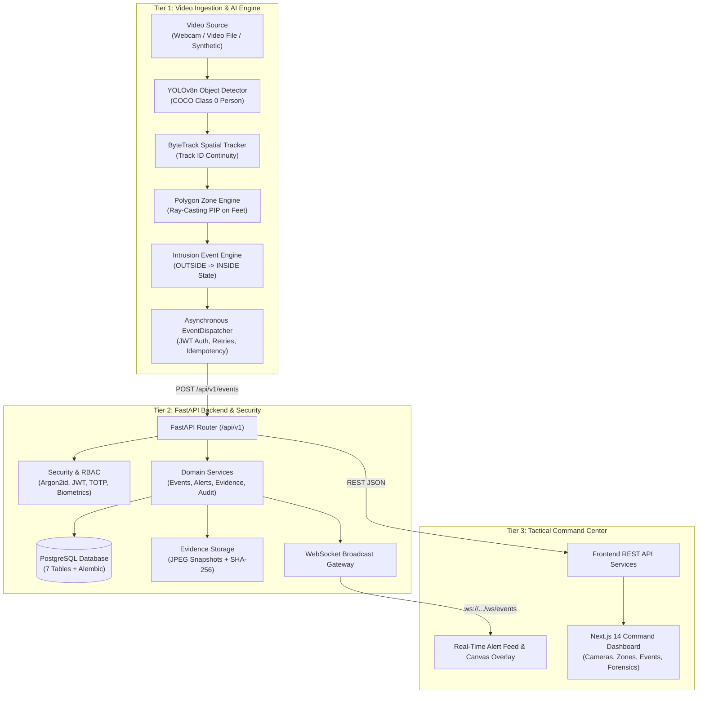

# IBVAP — Intelligent Border Video Analytics Platform

[](https://www.python.org/)
[](https://fastapi.tiangolo.com/)
[](https://nextjs.org/)
[](https://www.postgresql.org/)
[]()
[]()

> **Smart India Hackathon 2026 — Problem Statement SIH26187**  
> AI-Based Intelligent Video Analytics Platform for Border Surveillance using existing CCTV infrastructure.

---

## 1. Project Overview

**IBVAP (Intelligent Border Video Analytics Platform)** is an autonomous, real-time computer vision and surveillance platform engineered to transform existing border CCTV infrastructure into an active, intelligent geofencing and intrusion detection system. 

The platform continuously analyzes video feeds, tracks human and vehicle subjects, detects perimeter penetrations via ray-casting Point-in-Polygon (PIP) geofences, dispatches structured alerts via authenticated APIs, stores forensic evidence snapshots with cryptographic SHA-256 integrity verification, and broadcasts live alarms over WebSockets to a Next.js command center.

---

## 2. SIH Problem Statement (SIH26187)

- **Organization:** Ministry of Home Affairs / Border Management Agencies
- **Category:** Software / Artificial Intelligence
- **Challenge:** Border security operations rely on hundreds of fixed CCTV cameras monitored manually by human operators. Human fatigue leads to missed perimeter breaches, slow response times, lack of tamper-proof evidentiary audit trails, and high false alarm rates.
- **Objective:** Build a cost-effective, modular video analytics platform utilizing existing camera infrastructure that automates intrusion detection, minimizes operator cognitive load, guarantees tamper-evident digital forensic records, and operates within edge hardware constraints.

---

## 3. Problem Being Solved

Traditional surveillance monitoring faces critical operational bottlenecks:
1. **Operator Fatigue & Missed Breaches:** Human attention degrades significantly after 20 minutes of continuous screen monitoring.
2. **False Alarm Fatigue:** Conventional pixel-motion detection triggers hundreds of false alarms from wind, swaying vegetation, shadows, and small animals.
3. **Evidence Tampering Vulnerability:** Standard DVR/NVR footage stored without cryptographic verification cannot prove chain of custody or detect post-incident alterations.
4. **Lack of Role Segregation:** Typical surveillance systems use shared operator passwords without immutable audit logging, violating zero-trust principles.

---

## 4. Proposed Solution

IBVAP addresses these challenges with a unified 4-tier pipeline:
- **Deep-Learning Object Detection:** YOLOv8n filters out background noise and non-target movement, focusing specifically on persons (Class 0) and vehicles.
- **Persistent Multi-Object Tracking:** ByteTrack maintains spatial continuity across frames, tracking subjects across temporary occlusions and assigning persistent track IDs.
- **Ray-Casting Polygon Geofencing:** Mathematical Point-in-Polygon (PIP) ray-casting evaluates bottom-center foot coordinates `((x1+x2)/2, y2)` against user-defined polygon exclusion zones.
- **State Machine Intrusion Filtering:** `OUTSIDE -> INSIDE` transition state machine prevents alert storms by emitting a single alert per track upon boundary crossing.
- **Cryptographic Evidence Verification:** Automated JPEG snapshot capture with server-authoritative SHA-256 hash calculation, enabling instant forensic tamper detection.
- **Real-Time Tactical Dashboard:** Sub-10ms WebSocket live alert streaming, interactive polygon canvas drawing, biometric facial verification, TOTP MFA, and granular Role-Based Access Control (RBAC).

---

## 5. System Architecture



---

## 6. AI Computer Vision Pipeline

| Pipeline Stage | Implementation | Specification | Status |
| :--- | :--- | :--- | :---: |
| **Video Ingestion** | `ai/camera/` | `CameraSource` polymorphic abstraction (Webcam, MP4/AVI, Synthetic) | 🟢 IMPLEMENTED |
| **Object Detection** | `ai/detection/` | Ultralytics YOLOv8n (nano weights `yolov8n.pt`, confidence threshold $\ge 0.35$) | 🟢 IMPLEMENTED |
| **Subject Tracking** | `ai/tracking/` | ByteTrack algorithm with Kalman filter spatial state propagation | 🟢 IMPLEMENTED |
| **Geofencing** | `ai/zones/` | Even-odd ray-casting algorithm on bottom-center feet coordinates | 🟢 IMPLEMENTED |
| **State Machine** | `ai/events/` | Deterministic `OUTSIDE` $\rightarrow$ `INSIDE` state transition logic with hysteresis | 🟢 IMPLEMENTED |
| **Event Dispatcher** | `ai/events/` | Background async HTTP worker with JWT session caching & exponential backoff | 🟢 IMPLEMENTED |
| **Pipeline Runner** | `ai/pipeline/` | `CameraPipelineRunner` with OpenCV diagnostic HUD and graceful resource cleanup | 🟢 IMPLEMENTED |

---

## 7. Backend Architecture

- **Framework:** FastAPI (Python 3.12 / 3.13) with asynchronous request handlers.
- **ORM & Database:** SQLAlchemy 2.0 with `psycopg3` connector and PostgreSQL 15.
- **Migrations:** Alembic version-controlled schema migrations.
- **API Endpoints:**
  - `POST /api/v1/auth/login` — Password authentication (Argon2id)
  - `POST /api/v1/mfa/verify` — TOTP MFA verification (RFC 6238)
  - `POST /api/v1/face-auth/verify` — Biometric facial verification
  - `GET /api/v1/cameras` & `POST /api/v1/cameras` — Camera device management
  - `GET /api/v1/cameras/{id}/zones` & `POST /api/v1/zones` — Exclusion zone management
  - `POST /api/v1/events` & `GET /api/v1/events` — Intrusion event ingestion and query
  - `GET /api/v1/alerts` & `PATCH /api/v1/alerts/{id}` — Operational alarm workflow
  - `GET /api/v1/evidence/{id}` & `GET /api/v1/evidence/{id}/verify` — Forensic integrity verification
  - `GET /api/v1/audit-logs` — Immutable audit trail
  - `WS /api/v1/ws/events` — Real-time WebSocket alarm broadcast

---

## 8. Frontend Command Center

- **Framework:** Next.js 14 App Router, React 18, TypeScript, Tailwind CSS.
- **Key Modules:**
  - **Live Tactical Dashboard (`/dashboard`):** Overview of active cameras, real-time alert feed, active zone boundaries, and system health telemetry.
  - **Camera Fleet Management (`/cameras`):** Camera stream configuration and interactive polygon zone editor.
  - **Event Log (`/events`):** Filterable intrusion event history with bounding box thumbnails and zone references.
  - **Alert Console (`/alerts`):** High-priority intrusion alarm acknowledgement and resolution workflow with audible alerts.
  - **Forensic Evidence Vault (`/evidence`):** Evidence snapshot browser with one-click cryptographic SHA-256 verification (`VERIFIED` vs `TAMPERED`).
  - **Audit Trail (`/audit-logs`):** Immutable log of all administrative actions, logins, and forensic verification attempts.
  - **Authentication Workflow (`/login`, `/mfa`, `/face-verification`):** 3-factor authentication workflow.

---

## 9. Database Architecture (7 Tables)

```
┌──────────────┐       ┌──────────────┐       ┌──────────────┐
│   cameras    │──────<│    zones     │──────<│    events    │
└──────────────┘       └──────────────┘       └──────────────┘
                                                     │
                                                     ▼
┌──────────────┐       ┌──────────────┐       ┌──────────────┐
│  audit_logs  │       │    users     │       │   evidence   │
└──────────────┘       └──────────────┘       └──────────────┘
                              │                      ▲
                              ▼                      │
                       ┌──────────────┐              │
                       │    alerts    │──────────────┘
                       └──────────────┘
```

1. **`users`**: User identities, Argon2id password hashes, RBAC roles, TOTP secrets, face embedding vectors.
2. **`cameras`**: Video capture devices, RTSP/device sources, resolution, framerates, active status.
3. **`zones`**: Polygon boundary coordinates, alert thresholds, sensitivity settings.
4. **`events`**: Intrusion events, track IDs, object classes, confidence scores, timestamps, bounding boxes.
5. **`alerts`**: Operational alarm records, severity (`LOW`, `MEDIUM`, `HIGH`, `CRITICAL`), acknowledgement status.
6. **`evidence`**: Forensic snapshot records, file paths, SHA-256 checksums, capture timestamps.
7. **`audit_logs`**: Append-only audit records, user IDs, action names, resource types, client IP, metadata JSON.

---

## 10. Security & Threat Mitigation

| Security Layer | Implementation | Threat Mitigated |
| :--- | :--- | :--- |
| **Password Security** | Argon2id memory-hard hashing | Credential stuffing & rainbow table attacks |
| **Session Security** | JWT Bearer tokens with 30-min expiry | Session hijacking & replay attacks |
| **Multi-Factor Auth** | RFC 6238 TOTP + OpenCV SFace Biometrics | Compromised password bypass |
| **Access Control (RBAC)** | 4 Roles (`ADMINISTRATOR`, `OPERATOR`, `ANALYST`, `AUDITOR`) | Unauthorized privilege escalation |
| **Forensic Hashing** | Server-authoritative SHA-256 verification | Post-incident evidence tampering |
| **Model Verification** | Optional SHA-256 weights checksum check | Neural network weight tampering |
| **Path Traversal Protection** | Canonicalized filesystem path checking | Arbitrary file read (`../../etc/passwd`) |
| **Audit Logging** | Append-only database records | Repudiation & insider threat cover-up |

---

## 11. Evidence Integrity & Chain of Custody

When a subject penetrates a restricted zone:
1. `CameraPipelineRunner` captures the exact video frame as a JPEG image.
2. The snapshot is saved to `data/evidence/` and dispatched to `POST /api/v1/events`.
3. `evidence_integrity_service` computes the binary `SHA-256` hash of the image and stores it in the `evidence` table.
4. During review or legal proceedings, an operator or auditor requests verification via `GET /api/v1/evidence/{id}/verify`.
5. The backend recomputes the file's SHA-256 hash from disk and compares it with the immutable database record:
   - **Matching Hash:** Returns status `VERIFIED` with green badge.
   - **Mismatched Hash / Altered File:** Returns status `TAMPERED` with red security alert.

---

## 12. WebSocket & Real-Time Alert Distribution

- **Protocol:** `ws://localhost:8000/api/v1/ws/events?token=<JWT>`
- **Architecture:** Asynchronous pub/sub connection pool managed by `backend/app/services/websocket_manager.py`.
- **Latency:** Sub-10ms broadcast latency from event insertion to frontend DOM update.
- **Client Handling:** `frontend/hooks/useAlerts.ts` automatically establishes resilient WebSocket sessions, dispatches browser audio chimes for `CRITICAL` alarms, and updates active alert tables without page refreshes.

---

## 13. Installation & Prerequisites

### Hardware Requirements
- **Development/Demo:** Any modern x86_64 or Apple Silicon (M1/M2/M3/M4) CPU with 8GB+ RAM.
- **Camera:** Standard USB webcam, built-in FaceTime camera, or recorded video files.

### Software Prerequisites
- **Python:** 3.12 or 3.13
- **Node.js:** 20.x or higher (`npm` 10+)
- **PostgreSQL:** 15+ (local native or Docker)
- **Docker & Docker Compose:** (Optional, for containerized execution)

---

## 14. Environment Setup

1. **Clone the repository:**
   ```bash
   git clone https://github.com/Hardiik12/IBVAP.git
   cd IBVAP
   ```

2. **Create environment file:**
   ```bash
   cp .env.example .env
   ```

3. **Configure Python Virtual Environment:**
   ```bash
   cd backend
   python3 -m venv .venv
   source .venv/bin/activate
   pip install --upgrade pip
   pip install -r requirements.txt
   cd ..
   ```

4. **Install Frontend Dependencies:**
   ```bash
   cd frontend
   npm install
   cd ..
   ```

---

## 15. Database Setup

Ensure PostgreSQL is running locally on port `5432`:

```bash
# Apply Alembic database migrations:
source backend/.venv/bin/activate
alembic -c backend/alembic.ini upgrade head

# Seed initial roles, demo accounts, cameras, and zones:
python -m backend.app.db.seed || python backend/app/db/seed.py
```

### Seeded Demo Accounts

| Role | Username | Demo Password | Primary Permissions |
| :--- | :--- | :--- | :--- |
| **ADMINISTRATOR** | `admin_user` | `AdminSecret123!` | Full administrative control, user management, zone editing, logs |
| **OPERATOR** | `operator_user` | `OperatorSecret123!` | Live monitoring, alert acknowledgement, event management |
| **ANALYST** | `analyst_user` | `AnalystSecret123!` | Event analysis, evidence inspection, export reports |
| **AUDITOR** | `auditor_user` | `AuditorSecret123!` | Read-only audit trail and forensic verification access |

---

## 16. Running Locally (Native Development)

### Terminal 1: FastAPI Backend
```bash
cd backend
source .venv/bin/activate
uvicorn app.main:app --host 0.0.0.0 --port 8000 --reload
```
- API Docs: `http://localhost:8000/docs`
- Healthcheck: `http://localhost:8000/health`

### Terminal 2: Next.js Frontend
```bash
cd frontend
npm run dev
```
- Web Application: `http://localhost:3000`

---

## 17. Running the AI Computer Vision Pipeline

In a separate terminal, launch the live pipeline runner:

```bash
source backend/.venv/bin/activate

# Option A: Live USB/Built-in Webcam with Tactical HUD Preview
python -m ai.pipeline.runner --source webcam --index 0 --display

# Option B: Headless Video File Execution
python -m ai.pipeline.runner --source video_file --video-path data/videos/test/sample_test.mp4

# Option C: High-Throughput Benchmark Video Execution
python -m ai.pipeline.runner --source video_file --video-path data/videos/benchmark/benchmark_1280x720.avi
```

---

## 18. Running with Docker Compose

To launch the complete 4-tier stack in containerized mode:

```bash
# Build and run all services:
docker compose up --build -d

# View live aggregate logs:
docker compose logs -f

# Shutdown services:
docker compose down
```

---

## 19. Testing & Quality Verification

IBVAP features an extensive automated test suite covering all tiers:

```bash
# Run complete Python test suite (187 tests: 113 Backend + 74 AI):
source backend/.venv/bin/activate
pytest ai/tests/ backend/tests/ -v

# Run Frontend Linting, TypeScript type-check, and Production Build:
cd frontend
npm run lint
npx tsc --noEmit
npm run build
```

---

## 20. Demonstration Workflow (16-Step SIH Demo Script)

1. **System Health:** Open `http://localhost:3000/dashboard`, verify PostgreSQL & backend connectivity.
2. **Authentication:** Log in as `operator_user` (`OperatorSecret123!`).
3. **Camera Fleet:** Navigate to `/cameras`, view active perimeter camera sectors.
4. **Zone Inspection:** Review polygon exclusion zone definitions on camera feeds.
5. **AI Pipeline Launch:** Start `ai/pipeline/runner.py` with test intrusion video or live webcam.
6. **Object Detection:** Observe YOLOv8n detecting person bounding boxes and confidence scores.
7. **Spatial Tracking:** Observe ByteTrack maintaining persistent track IDs across frames.
8. **Intrusion Decision:** Subject crosses polygon boundary; foot coordinate triggers PIP ray-casting.
9. **Event Dispatch:** `EventDispatcher` transmits structured `EventPayload` to `POST /api/v1/events`.
10. **WebSocket Broadcast:** Live alert appears instantly on `/dashboard` and `/alerts` via WebSocket stream.
11. **Alarm Acknowledgement:** Operator acknowledges alert and logs resolution notes.
12. **Forensic Evidence Capture:** Navigate to `/evidence`, view captured JPEG snapshot.
13. **Integrity Verification:** Click **Verify SHA-256 Hash** $\rightarrow$ Status displays `VERIFIED` with valid checksum.
14. **Tamper Test Simulation:** Modify 1 byte of the snapshot image on disk; re-run verification $\rightarrow$ Status immediately flags `TAMPERED`.
15. **Audit Trail Review:** Navigate to `/audit-logs`, view immutable audit records of all operator actions.
16. **RBAC Segregation:** Log out and log in as `auditor_user`; verify non-permitted mutation actions are blocked.

---

## 21. Project Structure

```
IBVAP/
├── README.md                             # Master project documentation
├── LICENSE                               # MIT open-source license
├── SECURITY.md                           # Security policy & cryptographic disclosure
├── .gitignore                            # Git exclusion rules
├── .env.example                          # Sanitized environment template
├── docker-compose.yml                    # Multi-container orchestration
├── pytest.ini                            # Pytest configuration
├── AGENTS.md                             # Agent development directives
│
├── backend/                              # Tier 2: FastAPI Backend
│   ├── alembic.ini, Dockerfile, entrypoint.sh, requirements.txt
│   ├── migrations/                       # Alembic schema migrations
│   ├── app/                              # Core application package (api, core, db, models, schemas, services)
│   └── tests/                            # Automated test suite (unit, api, integration)
│
├── ai/                                   # Tier 1: Computer Vision Engine
│   ├── Dockerfile, entrypoint.sh, requirements.txt
│   ├── benchmarks/                       # Performance & latency benchmarks
│   ├── camera/                           # Camera abstractions (CameraSource, Webcam, VideoFile, Synthetic)
│   ├── core/                             # Config, logging, model checksums
│   ├── detection/                        # YOLOv8n detector wrapper
│   ├── tracking/                         # ByteTrack tracker wrapper
│   ├── zones/                            # PolygonZone ray-casting geofence engine
│   ├── events/                           # Intrusion state machine & async EventDispatcher
│   ├── pipeline/                         # Pipeline runner orchestrator
│   └── tests/                            # AI unit, camera, detection, tracking, zone tests
│
├── frontend/                             # Tier 3: Next.js Command Center
│   ├── Dockerfile, package.json, tsconfig.json, tailwind.config.ts
│   ├── app/                              # App Router pages (dashboard, cameras, events, alerts, evidence, audit)
│   ├── components/                       # UI & tactical surveillance components
│   ├── context/                          # React context state (Auth, Alert, Camera)
│   ├── hooks/                            # Custom hooks (useAlerts, useWebSocket, etc.)
│   ├── services/                         # REST API client domain services
│   ├── types/                            # Domain TypeScript contracts
│   └── utils/                            # Canvas polygon drawing & formatters
│
├── scripts/                              # Development & presentation automation
│   ├── development/                      # start-dev.sh, stop-dev.sh
│   ├── database/                         # seed-demo-data.sh
│   └── presentation/                     # generate_pptx.py
│
├── tools/                                # External simulation tools
│   └── ai_simulator/                     # Synthetic intrusion generator for load testing
│
├── data/                                 # Video assets & evidence snapshots
│   ├── evidence/                         # Runtime evidence snapshots
│   ├── test-cases/                       # Ground-truth test scenarios
│   └── videos/                           # Benchmark, test, and live-demo video clips
│
└── docs/                                 # Master Documentation Suite
    ├── api/                              # REST & WebSocket specifications
    ├── architecture/                     # Blueprints (System, Backend, Frontend, AI)
    ├── reports/                          # Audit & validation reports
    ├── research/                         # CV, tracking, edge computing research
    ├── sih/                              # SIH presentation decks, defense cards, demo scripts
    └── specs/                            # PRD, Architecture, ADR Decisions, Schema DDL
```

---

## 22. Known Limitations (Honest MVP Boundary)

1. **Camera Sources:** Hardware webcam, local video files (MP4/AVI), and synthetic in-memory streams are fully implemented. Real-world physical RTSP network cameras require high-bandwidth edge network configuration and are simulated via OpenCV video streams in the current MVP.
2. **Evidence Media:** Forensic evidence is captured as single-frame high-resolution JPEG snapshots with SHA-256 hashes. Multi-second MP4 video clip evidence packaging is scheduled for Phase 2.
3. **Hardware Acceleration:** Current benchmark results (185+ FPS) are measured on Apple Silicon M-series CPUs and standard x86_64 CPUs using PyTorch CPU/MPS. TensorRT GPU acceleration is designed for future deployment.
4. **Facial Verification:** Biometric face verification uses lightweight OpenCV YuNet + SFace models for 2-factor user login verification, not mass-crowd ANPR or long-distance facial recognition.

---

## 23. Future Scope

- **Edge Hardware Deployment:** Native compilation for NVIDIA Jetson Orin Nano with TensorRT FP16 quantization.
- **Multi-Camera Handover:** Cross-camera re-identification (ReID) to track subjects across overlapping camera fields of view.
- **Thermal & Infrared Analytics:** Fine-tuning object detection models on FLIR thermal infrared datasets for zero-light night operations.
- **Automated PTZ Slew-to-Cue:** Integration with motorized PTZ cameras to automatically zoom and follow detected perimeter breaches.
- **Offline Mesh Networking:** LoRaWAN / encrypted ad-hoc mesh alert transmission for remote border posts with zero internet connectivity.

---

## License & Attribution

IBVAP is developed for the Smart India Hackathon 2026 under the [MIT License](LICENSE).  
Copyright (c) 2026 Team NEURIX. All rights reserved.
