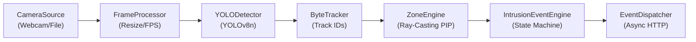

# IBVAP AI Pipeline Specification

**Module:** `ai/pipeline/runner.py`  
**Throughput:** 185+ FPS on standard 1280x720 video (sub-6ms latency)  
**Architecture:** Synchronous frame inference with decoupled asynchronous HTTP event dispatching  

---

## 1. Pipeline Execution Flow



1. **Frame Acquisition:** `CameraSource.read()` acquires BGR frames from the configured video source.
2. **Preprocessing:** `FrameProcessor` validates frame dimensions, computes rolling FPS moving average, and resizes if target dimensions are set.
3. **Detection:** `YOLODetector` runs inference and extracts bounding boxes for target classes (persons, vehicles).
4. **Tracking:** `ByteTracker` associates detections across consecutive frames, assigning stable Track IDs.
5. **Geofencing:** `ZoneEngine` evaluates bottom-center foot coordinates against active polygon boundaries.
6. **State Machine:** `IntrusionEventEngine` detects `OUTSIDE -> INSIDE` transitions and suppresses repeated alerts for continuous presence.
7. **Event Dispatching:** `EventDispatcher` asynchronously serializes the event payload, attaches JWT authentication, and posts to `POST /api/v1/events`.

---

## 2. Pipeline CLI Options

```bash
# Live webcam preview mode
python -m ai.pipeline.runner --source webcam --index 0 --display

# Video file execution
python -m ai.pipeline.runner --source video_file --video-path data/videos/test/sample_test.mp4

# High-throughput benchmark
python -m ai.pipeline.runner --source video_file --video-path data/videos/benchmark/benchmark_1280x720.avi
```
