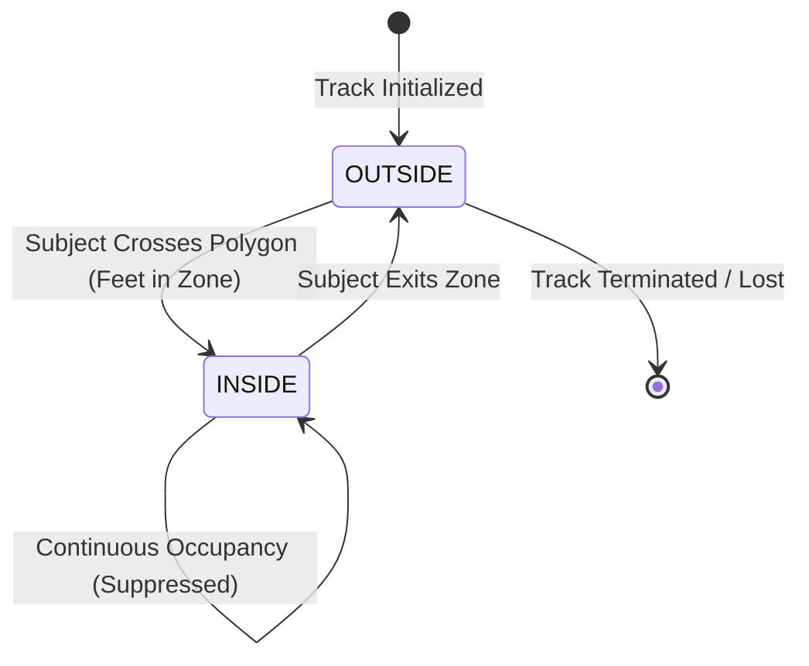

# IBVAP Intrusion Event State Machine

**Module:** `ai/events/engine.py`  
**State Machine:** Per-track, per-zone occupancy tracking  
**States:** `OUTSIDE`, `INSIDE`  

---

## 1. State Transition Matrix

- **`OUTSIDE -> INSIDE` (Transition Trigger):**
  1. Emits new `IntrusionEvent` record with timestamp, bounding box, confidence, and snapshot frame.
  2. Updates track state to `INSIDE`.
  3. Dispatches event to `EventDispatcher`.
- **`INSIDE -> INSIDE` (Continuous Presence):**
  - Alert suppression suppresses duplicate alert emissions, preventing operator alert fatigue while the intruder remains in the zone.
- **`INSIDE -> OUTSIDE` (Exit Transition):**
  - Resets state back to `OUTSIDE`. If the subject re-enters later, a new intrusion event is generated.
