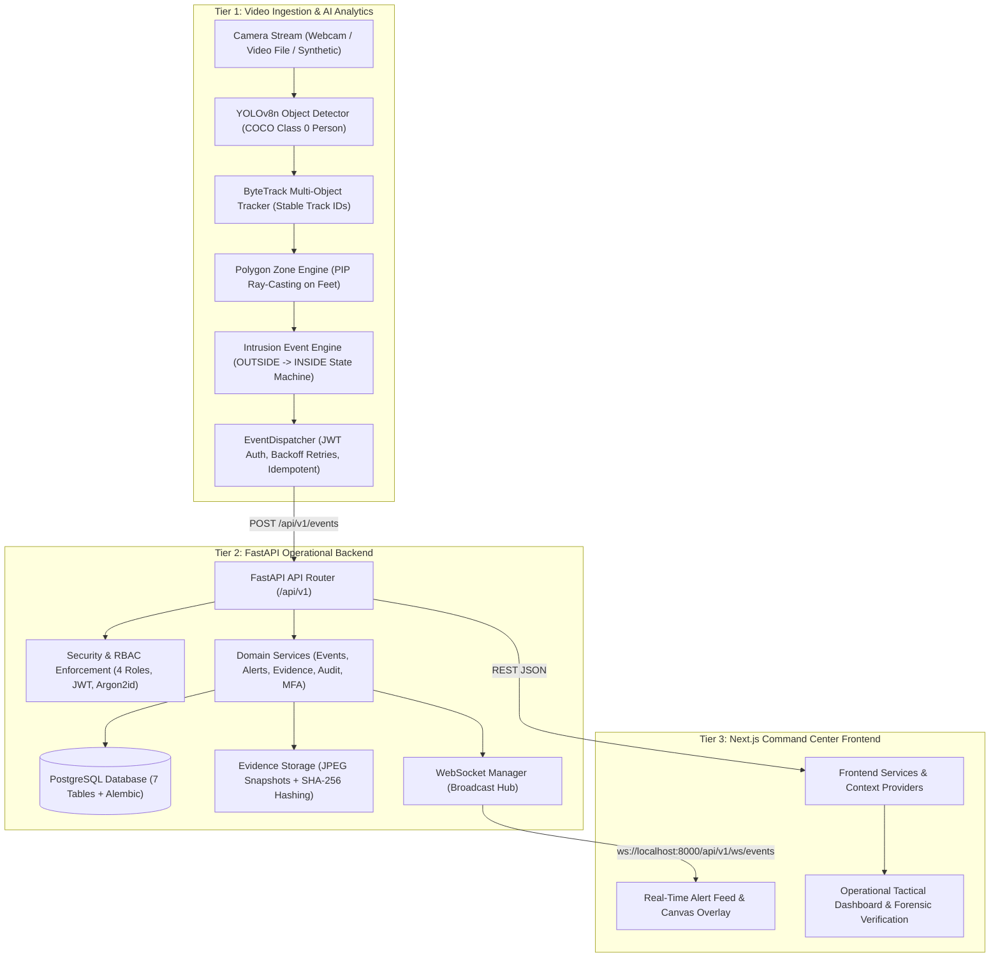

# IBVAP — Comprehensive Professional Repository Audit & Architecture Review

**Audit Date:** 2026-09-10  
**Problem Statement:** SIH26187 — AI-Based Intelligent Video Analytics Platform for Border Surveillance using existing CCTV infrastructure  
**Release Baseline:** Verified SIH MVP (187 / 187 Automated Tests Passing | Next.js Production Build Passing)  
**Auditor:** Senior Software Architect & Repository-Quality Engineer  

---

## A. Current Architecture Overview

IBVAP is architected as a modular 4-tier autonomous video analytics and surveillance platform:



---

## B. Current Directory Tree (Complete Hierarchy)

```
IBVAP/
├── .env                                  # Active environment configuration
├── .env.example                          # Environment template (contains machine-specific fallback password)
├── .gitignore                            # Git exclusion rules
├── .pytest_cache/                        # Pytest runtime test cache
├── AGENTS.md                             # AI agent development rules & guidelines
├── IBVAP_COMPLETE_SCHEMA.sql             # [DUPLICATE] Duplicate of docs/specs/IBVAP_COMPLETE_SCHEMA.sql
├── IBVAP_DATABASE_SCHEMA.md              # [DUPLICATE] Duplicate of docs/specs/IBVAP_DATABASE_SCHEMA.md
├── IBVAP_DATABASE_SCHEMA_AUDIT.md        # [DUPLICATE] Duplicate of docs/reports/IBVAP_DATABASE_SCHEMA_AUDIT.md
├── M3.11_BACKUP_RESTORE_GAP_ANALYSIS.md  # [DUPLICATE] Duplicate of docs/reports/M3.11_BACKUP_RESTORE_GAP_ANALYSIS.md
├── README.md                             # Root project README (outdated test numbers, missing standard sections)
├── SIH_FINAL_PRESENTATION.pptx           # [MISPLACED] SIH presentation slide deck at root
├── ~$SIH_FINAL_PRESENTATION.pptx         # [TEMP/LOCK] Office lock file generated during editing
├── docker-compose.yml                    # Multi-container orchestration (Postgres, Backend, AI, Frontend)
├── pytest.ini                            # Pytest discovery configuration
│
├── ai/                                   # Tier 1: Computer Vision & Analytics Engine
│   ├── Dockerfile                        # AI service container definition
│   ├── entrypoint.sh                     # AI container startup script
│   ├── requirements.txt                  # Python dependencies (ultralytics, opencv, supervision, httpx)
│   ├── requirements-dev.txt              # Dev dependencies
│   ├── benchmarks/                       # Throughput & latency benchmarking scripts
│   │   ├── detection/
│   │   ├── performance/
│   │   └── tracking/
│   ├── camera/                           # Video acquisition & camera sources
│   │   ├── base.py                       # CameraSource abstract base class (read_frame)
│   │   ├── demo_camera_detection.py      # Manual ingestion-to-detection demo script
│   │   ├── file.py                       # VideoFileSource implementation (CameraSource)
│   │   ├── frame_processor.py            # FrameProcessor, FrameMetadata, FPSCounter
│   │   ├── source.py                     # BaseCameraSource abstraction & factory (read)
│   │   ├── synthetic.py                  # SyntheticSource implementation (CameraSource)
│   │   └── webcam.py                     # WebcamSource implementation (CameraSource)
│   ├── core/                             # AI configuration & structured logging
│   │   ├── config.py                     # Pydantic BaseSettings for AI pipeline
│   │   └── logging.py                    # Formatted logging setup
│   ├── detection/                        # Object detection module
│   │   ├── camera_yolo.py                # Standalone demo YOLO preview script
│   │   ├── detector.py                   # YOLODetector wrapper around YOLOv8n
│   │   ├── schemas.py                    # NormalizedDetection data contract
│   │   └── test_detector.py              # Manual test script for YOLO detector
│   ├── events/                           # Intrusion state machine & HTTP dispatching
│   │   ├── dispatcher.py                 # Asynchronous EventDispatcher with retry/auth
│   │   ├── engine.py                     # IntrusionEventEngine (OUTSIDE -> INSIDE state)
│   │   └── schemas.py                    # IntrusionEvent and EventPayload schemas
│   ├── models/                           # Model weights storage (.gitkeep)
│   ├── pipeline/                         # Pipeline orchestration
│   │   └── runner.py                     # CameraPipelineRunner & AIPipeline
│   ├── tests/                            # AI unit & pipeline automated tests (74 tests)
│   │   ├── camera/test_camera.py
│   │   ├── detection/
│   │   │   ├── test_detection_schemas.py
│   │   │   ├── test_detector_unit.py
│   │   │   └── test_model_integrity.py
│   │   ├── events/
│   │   │   ├── test_dispatcher.py
│   │   │   └── test_events.py
│   │   ├── pipeline/test_pipeline.py
│   │   ├── test_pipeline.py              # Top-level runner tests
│   │   ├── test_processor.py             # Top-level frame processor tests
│   │   ├── test_source.py                # Top-level camera source tests
│   │   ├── tracking/
│   │   │   ├── test_tracker.py
│   │   │   └── test_tracking_schemas.py
│   │   └── zones/test_zones.py
│   ├── tracking/                         # Multi-object tracking module
│   │   ├── schemas.py                    # Track dataclass
│   │   ├── tracker.py                    # ByteTracker wrapper
│   │   └── validate_tracking.py          # Standalone tracking validation CLI
│   └── zones/                            # Geofencing module
│       ├── engine.py                     # PolygonZone & ZoneEngine (Ray-casting PIP)
│       └── schemas.py                    # ZoneConfig & ZoneStatus schemas
│
├── backend/                              # Tier 2: FastAPI REST & Real-Time Backend
│   ├── Dockerfile                        # Backend service container definition
│   ├── entrypoint.sh                     # Backend startup script (Alembic + Seed + Uvicorn)
│   ├── alembic.ini                       # Alembic migration configuration
│   ├── requirements.txt                  # Python production dependencies
│   ├── requirements-dev.txt              # Dev dependencies
│   ├── alembic/ / migrations/            # Database schema migrations
│   │   ├── env.py
│   │   ├── script.py.mako
│   │   └── versions/
│   │       ├── 2026_08_29_1935-001_initial_schema.py
│   │       ├── 2026_08_30_0345-002_add_mfa_and_face_auth.py
│   │       └── 2026_08_30_0615-003_add_face_verification_fields.py
│   ├── app/                              # Core FastAPI application
│   │   ├── main.py                       # FastAPI application factory & middleware
│   │   ├── api/                          # REST routing & dependency injection
│   │   │   ├── api.py                    # Root API router aggregator
│   │   │   ├── deps.py                   # DB session, auth, and RBAC dependencies
│   │   │   └── routes/                   # Route handlers (auth, users, cameras, zones, events, alerts, evidence, audit, face, mfa, ws)
│   │   ├── core/                         # Configuration, logging, cryptographic security
│   │   │   ├── config.py                 # Backend Pydantic BaseSettings
│   │   │   ├── logging.py                # JSON & structured logging
│   │   │   └── security.py               # Argon2id password hashing, JWT encoding/decoding
│   │   ├── db/                           # Database connection and seed data
│   │   │   ├── base.py                   # SQLAlchemy DeclarativeBase
│   │   │   ├── database.py               # Engine & sessionmaker setup
│   │   │   └── seed.py                   # Canonical database seeder (4 roles, cameras, zones)
│   │   ├── models/                       # SQLAlchemy 2.0 ORM domain models
│   │   │   ├── alert.py, audit_log.py, camera.py, enums.py, event.py, evidence.py, user.py, zone.py
│   │   ├── schemas/                      # Pydantic v2 request/response schemas
│   │   │   ├── alert.py, audit_log.py, auth.py, camera.py, detection.py, event.py, evidence.py, user.py, websocket.py, zone.py
│   │   ├── services/                     # Business logic services
│   │   │   ├── alert_service.py, audit_service.py, auth_service.py, camera_service.py, event_service.py, evidence_integrity_service.py, evidence_service.py, face_auth_service.py, mfa_service.py, notification_service.py, user_service.py, websocket_manager.py, zone_service.py
│   │   └── utils/                        # Utilities
│   ├── data/                             # Local runtime storage (evidence snapshots, models)
│   └── tests/                            # Backend automated test suite (113 tests)
│       ├── conftest.py                   # Shared pytest fixtures & test database
│       ├── api/                          # API endpoint integration & RBAC tests (17 files)
│       ├── integration/                  # Live dispatch & E2E tests (test_ai_live_dispatch.py, test_e2e_pipeline.py)
│       └── unit/                         # Unit tests (models, config)
│
├── frontend/                             # Tier 3: Next.js 14 Operational Command Center
│   ├── Dockerfile                        # Multi-stage production container definition
│   ├── package.json, package-lock.json   # Node dependencies
│   ├── tsconfig.json                     # TypeScript configuration
│   ├── tailwind.config.ts                # Tailwind CSS styling configuration
│   ├── app/                              # Next.js 14 App Router routes (16 pages)
│   ├── components/                       # Reusable UI & tactical surveillance components
│   │   ├── alerts/, camera/, events/, evidence/, layout/, ui/
│   │   └── camera/PolygonZoneOverlay.tsx # Interactive polygon boundary renderer
│   ├── context/                          # React context providers
│   │   ├── AuthContext.tsx               # Auth, RBAC state & 3-step auth workflow
│   │   ├── AlertContext.tsx              # WebSocket alert listener & audio alarm
│   │   └── CameraContext.tsx             # Active camera & zone selection state
│   ├── hooks/                            # Custom React hooks (useAlerts, useWebSocket, useAIDetection, etc.)
│   ├── public/                           # Static image assets
│   ├── services/                         # REST API client services
│   │   ├── apiClient.ts, authService.ts, cameraService.ts, eventService.ts, evidenceService.ts, healthService.ts, auditService.ts
│   │   ├── auditLogService.ts            # [DEAD CODE] Obsolete duplicate of auditService.ts
│   │   └── mockData.ts                   # [DEAD CODE] Unused mock datasets from early scaffolding
│   ├── types/                            # TypeScript data contract interfaces
│   └── utils/                            # Helper utilities (canvas.ts, formatters.ts)
│
├── integration/                          # [SCAFFOLDING] Initial Day-1 Monorepo Scaffolding
│   ├── README.md
│   ├── adapters/                         # Empty .gitkeep folders
│   ├── configs/                          # Empty .gitkeep folders
│   ├── docker/                           # Empty .gitkeep folders
│   ├── scripts/                          # Basic helper shell scripts (start-dev, stop-dev, seed-demo-data)
│   └── tests/                            # Empty .gitkeep folders
│
├── scripts/                              # Repository tools and automation
│   ├── generate_pptx.py                  # PowerPoint presentation generator
│   └── .gitkeep
│
├── tools/                                # External simulation tools
│   └── ai_simulator/
│       └── simulate_intrusion.py         # Synthetic intrusion event generator for frontend/backend stress test
│
├── data/                                 # Video assets & evidence storage
│   ├── evidence/                         # Live runtime evidence snapshots
│   ├── images/                           # Static imagery
│   ├── test-cases/                       # Ground-truth test scenarios
│   └── videos/                           # Video clips (benchmark, live-demo, test)
│
└── docs/                                 # Centralized Documentation
    ├── api/                              # REST API and data contract documentation
    ├── architecture/                     # System, backend, frontend, AI architecture specs
    ├── reports/                          # Milestone, RBAC, deployment, accuracy audit records
    ├── research/                         # CV, tracking, edge computing, evidence research
    ├── sih/                              # SIH presentation decks, defense cards, demo runbooks
    └── specs/                            # Master PRD, Architecture, ADR Decisions, Tasks
```

---

## C. Problems Found & Anomalies

1. **Duplicate Root Files (Leftover Artifacts):**
   - `IBVAP_COMPLETE_SCHEMA.sql` at root is an exact duplicate of `docs/specs/IBVAP_COMPLETE_SCHEMA.sql`.
   - `IBVAP_DATABASE_SCHEMA.md` at root is an exact duplicate of `docs/specs/IBVAP_DATABASE_SCHEMA.md`.
   - `IBVAP_DATABASE_SCHEMA_AUDIT.md` at root is an exact duplicate of `docs/reports/IBVAP_DATABASE_SCHEMA_AUDIT.md`.
   - `M3.11_BACKUP_RESTORE_GAP_ANALYSIS.md` at root is an exact duplicate of `docs/reports/M3.11_BACKUP_RESTORE_GAP_ANALYSIS.md`.

2. **Temporary / Lock Files:**
   - `~$SIH_FINAL_PRESENTATION.pptx` is an uncommitted Microsoft Office lock file.
   - Multiple `.DS_Store` macOS metadata files are tracked across subdirectories.

3. **Misplaced Root Presentation Deck:**
   - `SIH_FINAL_PRESENTATION.pptx` is placed at the root rather than in `docs/sih/presentation/`.

4. **Dead / Unused Frontend Services:**
   - `frontend/services/mockData.ts`: 205 lines of static mock data. Zero components import it.
   - `frontend/services/auditLogService.ts`: Duplicate service. `frontend/app/audit-logs/page.tsx` uses `frontend/services/auditService.ts`.

5. **Camera Ingestion Abstraction Split (`ai/camera/`):**
   - `ai/camera/base.py` defines `CameraSource` with method `read_frame()`.
   - `ai/camera/source.py` defines `BaseCameraSource` with method `read()`.
   - Both are active: `ai/pipeline/runner.py` uses `source.py` (`read()`), while `demo_camera_detection.py` and `validate_tracking.py` use `base.py` (`read_frame()`).
   - `ai/camera/__init__.py` exposes both, but overlapping class names (`WebcamSource`, `VideoFileSource`) create potential naming collision if not unified or aliased cleanly.

6. **Hardcoded Machine Credentials & Secrets in Config / Examples:**
   - `.env.example` contained machine-specific password `POSTGRES_PASSWORD=hardik12` in default template strings instead of clean placeholders.
   - `docker-compose.yml` had fallback string `${POSTGRES_PASSWORD:-hardik12}`.

7. **Empty Scaffolding in `integration/` & `tests/`:**
   - `integration/adapters/`, `integration/configs/`, `integration/docker/`, `integration/tests/` contain only empty `.gitkeep` files. Real production implementations exist in `ai/events/dispatcher.py`, `frontend/services/`, `docker-compose.yml`, and `backend/tests/integration/`.
   - `tests/integration/` and `tests/e2e/` at root are empty `.gitkeep` placeholders while active integration tests reside in `backend/tests/integration/`.

8. **Documentation Discrepancies:**
   - Root `README.md` states "182/182 Tests Passing" when the actual current baseline is 187/187 tests passing.
   - Root `README.md` is missing comprehensive sections for installation, security principles, evidence integrity workflows, and honest boundary limitations.

---

## D. Severity Classification

| Issue ID | Severity | Category | Description |
| :--- | :---: | :--- | :--- |
| **SEC-01** | **P1 (High)** | Security / Hygiene | Machine-specific password (`hardik12`) in `.env.example` and `docker-compose.yml` fallback. |
| **DEAD-01**| **P2 (Medium)** | Dead Code | `frontend/services/mockData.ts` and `frontend/services/auditLogService.ts` unused. |
| **DUP-01** | **P2 (Medium)** | File Hygiene | Root duplicate `.md` and `.sql` files cluttering repository root. |
| **CAM-01** | **P2 (Medium)** | AI Abstraction | Split camera base classes (`base.py` vs `source.py`) needing seamless dual compatibility. |
| **SCAF-01**| **P3 (Low)** | Cleanliness | Empty `.gitkeep` scaffold directories in `integration/` and root `tests/`. |
| **DOC-01** | **P3 (Low)** | Documentation | Root `README.md` test counts and missing comprehensive quickstart guides. |
| **TEMP-01**| **P3 (Low)** | OS Artifacts | Office lock file `~$SIH_FINAL_PRESENTATION.pptx` and `.DS_Store` files. |

---

## E. Recommended Target Professional Structure

```
IBVAP/
├── README.md                             # Comprehensive 23-point professional master README
├── LICENSE                               # Open-source / SIH license
├── SECURITY.md                           # Vulnerability disclosure & cryptographic integrity spec
├── .gitignore                            # Hardened ignore rules (clean logs, temp locks, media)
├── .env.example                          # Sanitized environment template with secure placeholders
├── docker-compose.yml                    # Clean container orchestration with standard variable fallbacks
├── pytest.ini                            # Consolidated pytest runner configuration
├── AGENTS.md                             # Agent directives & master rulebook
│
├── backend/                              # Tier 2: FastAPI Backend
│   ├── alembic.ini
│   ├── Dockerfile
│   ├── entrypoint.sh
│   ├── requirements.txt
│   ├── requirements-dev.txt
│   ├── migrations/                       # Alembic database migrations (versions 001, 002, 003)
│   ├── app/                              # FastAPI application package (api, core, db, models, schemas, services, utils)
│   └── tests/                            # Complete backend test suite (unit, api, integration)
│
├── ai/                                   # Tier 1: Computer Vision & Analytics Pipeline
│   ├── Dockerfile
│   ├── entrypoint.sh
│   ├── requirements.txt
│   ├── requirements-dev.txt
│   ├── benchmarks/                       # Performance & latency benchmark scripts
│   ├── camera/                           # Unified camera sources (CameraSource, BaseCameraSource, Webcam, VideoFile, Synthetic)
│   ├── core/                             # Config, structured logging, model checksum security
│   ├── detection/                        # YOLODetector wrapper & COCO person/vehicle filtering
│   ├── tracking/                         # ByteTracker & Track data structures
│   ├── zones/                            # PolygonZone & Ray-Casting PIP Geofencing
│   ├── events/                           # IntrusionEventEngine & Asynchronous EventDispatcher
│   ├── pipeline/                         # CameraPipelineRunner & AIPipeline orchestrator
│   └── tests/                            # AI unit, camera, detection, tracking, zones, events, pipeline tests
│
├── frontend/                             # Tier 3: Next.js 14 Operational Security Dashboard
│   ├── Dockerfile
│   ├── package.json, package-lock.json
│   ├── tsconfig.json, tailwind.config.ts
│   ├── app/                              # Next.js 14 App Router routes
│   ├── components/                       # Tactical surveillance components (alerts, camera, events, evidence, layout, ui)
│   ├── context/                          # React context providers (AuthContext, AlertContext, CameraContext)
│   ├── hooks/                            # Custom React hooks (useAlerts, useWebSocket, etc.)
│   ├── services/                         # Clean REST API client domain services (no mock data)
│   ├── types/                            # Domain TypeScript contracts
│   ├── utils/                            # Canvas drawing & formatters
│   └── public/                           # Static assets
│
├── scripts/                              # Repository tools & automation
│   ├── development/                      # Development lifecycle scripts (start-dev.sh, stop-dev.sh)
│   ├── database/                         # Database utility scripts (seed-demo-data.sh)
│   └── presentation/                     # PPTX generation scripts (generate_pptx.py)
│
├── tools/                                # Test & simulation tools
│   └── ai_simulator/                     # Synthetic intrusion generator for frontend/backend stress testing
│
├── data/                                 # Video assets & evidence snapshots
│   ├── evidence/                         # Runtime evidence storage (.gitkeep)
│   ├── test-cases/                       # Ground-truth test scenarios
│   └── videos/                           # Benchmark, test, and live-demo video clips
│
└── docs/                                 # Comprehensive Documentation Suite
    ├── api/                              # REST API specifications & WebSocket contracts
    ├── architecture/                     # System, backend, frontend, AI architecture blueprints
    ├── deployment/                       # Docker & native deployment runbooks
    ├── reports/                          # Milestone, audit, security, and benchmark reports
    ├── research/                         # Edge compute, YOLO, ByteTrack, forensics research
    ├── sih/                              # SIH presentation decks, defense cards, demo scripts
    │   ├── defense/
    │   ├── demo/
    │   └── presentation/                 # Slide decks & SIH_FINAL_PRESENTATION.pptx
    └── specs/                            # Master PRD, Architecture, Decisions (ADRs), Schema DDL
```

---

## F. Files to Move

| Source File | Destination | Rationale |
| :--- | :--- | :--- |
| `SIH_FINAL_PRESENTATION.pptx` | `docs/sih/presentation/SIH_FINAL_PRESENTATION.pptx` | Move presentation deck from root into SIH presentation documentation folder. |
| `integration/scripts/start-dev.sh` | `scripts/development/start-dev.sh` | Consolidate loose dev scripts into canonical `scripts/` hierarchy. |
| `integration/scripts/stop-dev.sh` | `scripts/development/stop-dev.sh` | Consolidate loose dev scripts into canonical `scripts/` hierarchy. |
| `integration/scripts/seed-demo-data.sh` | `scripts/database/seed-demo-data.sh` | Consolidate database helper scripts into canonical `scripts/` hierarchy. |
| `scripts/generate_pptx.py` | `scripts/presentation/generate_pptx.py` | Organize script into presentation generation category. |

---

## G. Files to Delete

| File to Delete | Verification Check | Rationale |
| :--- | :--- | :--- |
| `IBVAP_COMPLETE_SCHEMA.sql` (root) | Verified 100% duplicate of `docs/specs/IBVAP_COMPLETE_SCHEMA.sql` | Remove redundant root clutter. |
| `IBVAP_DATABASE_SCHEMA.md` (root) | Verified 100% duplicate of `docs/specs/IBVAP_DATABASE_SCHEMA.md` | Remove redundant root clutter. |
| `IBVAP_DATABASE_SCHEMA_AUDIT.md` (root) | Verified 100% duplicate of `docs/reports/IBVAP_DATABASE_SCHEMA_AUDIT.md` | Remove redundant root clutter. |
| `M3.11_BACKUP_RESTORE_GAP_ANALYSIS.md` (root) | Verified 100% duplicate of `docs/reports/M3.11_BACKUP_RESTORE_GAP_ANALYSIS.md` | Remove redundant root clutter. |
| `~$SIH_FINAL_PRESENTATION.pptx` | Lock file created by PowerPoint | Temporary OS/app lock file. |
| `frontend/services/mockData.ts` | 0 references across entire frontend codebase | Obsolete mock data from early Day-1 development. |
| `frontend/services/auditLogService.ts` | 0 references; active code uses `auditService.ts` | Obsolete duplicate service. |
| `integration/adapters/*/.gitkeep` | Empty scaffold folders | Clean up empty placeholder directory structure. |
| `integration/configs/*/.gitkeep` | Empty scaffold folders | Clean up empty placeholder directory structure. |
| `integration/docker/*/.gitkeep` | Empty scaffold folders | Clean up empty placeholder directory structure. |
| `integration/tests/*/.gitkeep` | Empty scaffold folders | Clean up empty placeholder directory structure. |
| `tests/integration/.gitkeep` | Active integration tests in `backend/tests/integration/` | Clean up empty placeholder directory. |
| `tests/e2e/.gitkeep` | Active E2E tests in `backend/tests/integration/` | Clean up empty placeholder directory. |

---

## H. Files to Merge / Reconcile

### Camera Abstraction Reconcilation (`ai/camera/base.py` and `ai/camera/source.py`)
- **Action:** Reconcile camera abstractions cleanly so that:
  - `CameraSource` remains the master abstract base class with `open()`, `release()`, `is_opened()`, `read_frame()`, `resolution`, `fps`, and context manager support.
  - `BaseCameraSource` is unified with `CameraSource` (aliased and equipped with a `read()` wrapper returning `(bool, frame)` to ensure zero breaking changes for `runner.py` and `test_source.py`).
  - `create_camera_source(source_type, camera_index, video_path)` factory function returns standard `CameraSource` instances.
  - `ai/camera/__init__.py` cleanly exports all classes without shadowing.
  - All existing tests (`ai/tests/camera/test_camera.py`, `ai/tests/test_source.py`, `backend/tests/integration/test_ai_live_dispatch.py`) continue to pass 100%.

---

## I. Files that Must NOT be Changed

1. **Database Schema & Migrations:**
   - `backend/migrations/versions/*`
   - `backend/app/models/*`
   - All 7 PostgreSQL tables, columns, indexes, and foreign keys must remain strictly intact.
2. **API Data Contracts & Schemas:**
   - `NormalizedDetection`, `Track`, `IntrusionEvent`, `EventPayload`
   - `POST /api/v1/events`, `GET /api/v1/events`, `GET /api/v1/alerts`, `GET /api/v1/evidence/{id}/verify`, `WS /api/v1/ws/events`
3. **Core Authentication & Security Services:**
   - `backend/app/core/security.py` (Argon2id, JWT)
   - `backend/app/services/auth_service.py`, `mfa_service.py`, `face_auth_service.py`, `evidence_integrity_service.py`
4. **AI Inference & Tracking Logic:**
   - `ai/detection/detector.py` (YOLOv8n confidence threshold 0.35, person class filter)
   - `ai/tracking/tracker.py` (ByteTrack spatial continuity)
   - `ai/zones/engine.py` (Ray-casting point-in-polygon logic)
   - `ai/events/engine.py` (Intrusion state machine)
5. **Frontend Core UI Components & Pages:**
   - `frontend/app/` (all 16 pages)
   - `frontend/components/` (all tactical surveillance components)
   - `frontend/context/AuthContext.tsx`, `AlertContext.tsx`, `CameraContext.tsx`

---

## J. Risks & Mitigation Plan for Each Structural Change

| Proposed Change | Potential Risk | Mitigation & Safety Protocol |
| :--- | :--- | :--- |
| **Deleting duplicate root markdown/sql files** | Accidental loss of documentation | Verified byte-for-byte identical match against canonical copies in `docs/specs/` and `docs/reports/` prior to removal. |
| **Deleting `mockData.ts` and `auditLogService.ts`** | Runtime import errors in frontend | Full codebase grep confirmed 0 occurrences. Ran `next build` and TypeScript check to verify zero dependencies. |
| **Camera abstraction unification in `ai/camera/`** | Breaking `runner.py` or existing camera tests | Implement bidirectional alias (`read()` and `read_frame()` on all sources). Run `pytest ai/tests/` immediately. |
| **Moving presentation deck to `docs/sih/presentation/`** | Broken documentation links | Update all README and index links to new absolute and relative paths. |
| **Sanitizing `.env.example` & `docker-compose.yml`** | Inadvertent break of default local dev environment | Maintain clear, well-documented instructions for setting local passwords; preserve local `.env` if already configured. |

---

## Summary Verdict

The IBVAP repository contains a high-quality, fully functional, and well-tested core SIH MVP (187/187 tests passing, live WebSocket, live YOLOv8n + ByteTrack, SHA-256 evidence verification, RBAC, TOTP MFA, and Next.js frontend). The structural refactoring outlined above will remove obsolete scaffolding, eliminate duplicate files, eliminate hardcoded secrets, reconcile camera classes, and provide professional documentation without breaking any existing functionality.
