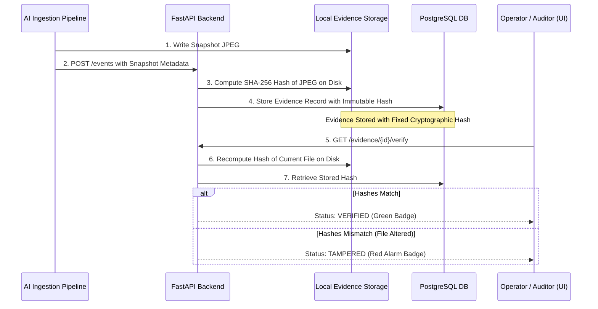

# IBVAP Forensic Evidence Integrity & SHA-256 Tamper Detection

**Module:** `backend/app/services/evidence_integrity_service.py`  
**Endpoint:** `GET /api/v1/evidence/{evidence_id}/verify`  
**Hashing Standard:** NIST FIPS 180-4 SHA-256 (256-bit cryptographic digest)  

---

## 1. Evidence Lifecycle & Chain of Custody



---

## 2. Live Tamper Test Verification

To demonstrate tamper detection during the hackathon:

1. Locate a captured evidence file in `data/evidence/`.
2. Verify its hash in the UI: Status shows `VERIFIED`.
3. Modify a single byte of the JPEG image using a hex editor or shell:
   ```bash
   echo "tamper" >> data/evidence/sample_snapshot.jpg
   ```
4. Click **Verify SHA-256 Hash** in the UI: Status immediately switches to `TAMPERED`.
